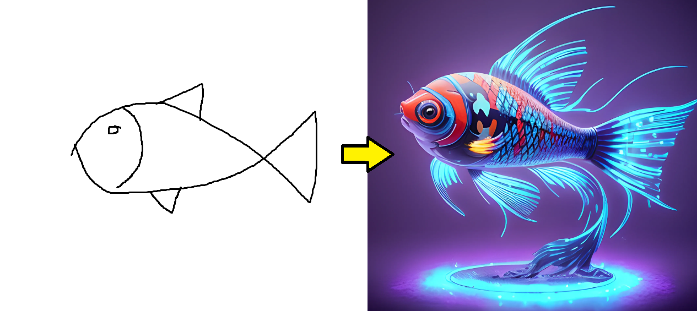
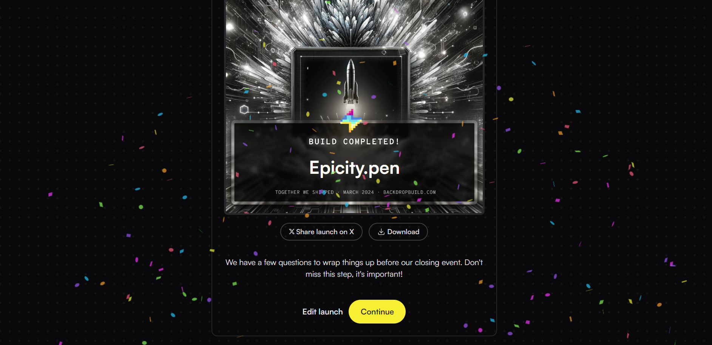

<h2 align="center"> Epicity.pen 🎨</h2>

This python application utilizes a powerful AI model trained on the expansive Google Quickdraw dataset, employing the EfficientNet
architecture to accurately interpret and analyze doodles. By integrating OpenAI's GPT-3.5 turbo engine, the app enriches
doodles with creative, exaggerated prompts, which are then transformed into final images using Stability AI's capabilities.
Initially imagined as a playful app for children, to make their drawings leap off the page in vivid color, this project 
embodies the intersection of AI and artistry I've always dreamed of exploring. 

👉 https://www.youtube.com/watch?v=o-h2aAEMUDg

- Clone the repository and run the file "epicity.py"
- Would need valid OpenAI and StabilityAI API keys in 'config.json' file
- requirements: "pip install Pillow numpy tensorflow openai stability_sdk"

 

This project is a part of the BackdropBuild V3 program. This collaborative initiative provided an unique opportunity to enhance my
skills in machine/deep-learning along with working and engaging with a diverse group of talented individuals. this is the result of
countless hours of dedication and collaborative effort during this intensive four-week sprint.

 

Future plans: Complete the mobile/web app using flutter.
